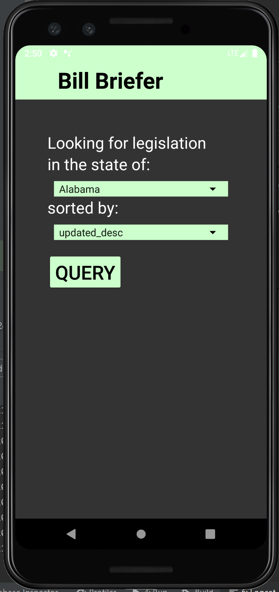

# Bill Briefer

[TOC]

##### Team

Jason Dent

##### Summary

Bill Briefer enables the user to casually keep up with state politics. The user enters a desired American state and is presented with an up-to-date list of legislative actions performed by the respective state government. The user can then click on an item from said list to learn more information about the bill. Certain bills will have been voted on and passed or failed. In this case, the user is generally able to see which state representative cast which vote. From here the user can discover information about specific representatives.



### External Resources

This application heavily utilizes an API called [Openstates](https://openstates.org/). This group makes a tremendous effort to provide government information in easy-to-download formats, such as their API or webscrapers. The API's 2 biggest endpoints are /bills and /people, returning database search results based on input parameters. We care most about the "jurisdiction" parameter, enabling us to search for events from specific states. We'll see later, though, that each state's information can be presented in various forms of completeness.

The app is comprised mostly from base functionality of Android utilities with a small exception of using Glide to display pictures. The code for this was modified from a homework to fit our usecase. Instead of trying to handle when images don't render, we simply hide the image and let the rest of the app speak for itself.

### UX/UI Specifics

A uniquely odd layout problem is the question of how to display an arbitrary number of voters. Sometimes there are no voters. Sometime there are twenty, sometimes there are 50+. This issue is normally fixed by using a RecyclerView. Unfortunately, the fragment where voters are listed is already boxed into a scrolling element. Having a scrolling element in a scrolling element would be a terrible user experience. Instead this can be solved by including an empty LinearLayout where the list of voters is placed. Programmatically, the back end goes through a list of voters that might be listed with the bill and adds a new TextView into this LinearLayout, one per voter. Thus, the voters are programmatically added as fixed object into the scrolling element.

### Backend Specifics

Almost all fragment transitions in this app are handled through ViewModel observers. For example, from a list of voters, the user can click a voter they are interested in seeing more information about. Instead of immediately loading a fragment the traditional way and sending in a bundle, there's an observer set to handle the transition. Here the work flow; the user click the voter they are interested in; the view model receives the id for this voter and sends a get request; the view model receives the get request; the get request is stored to a MutableLiveData<Person?> variable; an observer for this variable sees the variable is non-null and replaces the fragment with the ViewPerson fragment; the fragment fetches the MutableLiveData<Person?> variable; when the user hits a back button, this variable is set to null to allow the next voter to be selected. This is, in my opinion, a more clean method to handle the passage of data between fragments. Using intents makes thing more complicated with more edge cases. For example, say the get request returns an error code. Guess what? The LiveData variable doesn't get touched and the observer has no ability to load a new fragment. There is no possibility to accidentally load a fragment for a Person that doesn't exist.

Another interesting item is how the back button is handled. Because hitting back from any given fragment would need to alter ViewModel information specific to the fragment, we need a way to execute fragment specific code to perform clean up. This is accomplished as follows. The MainActivity overrides its onBackPressed function to call an unspecificed beforeBackPress function, owned by the MainActivity, then call super. This beforeBackPress function can be set by any fragment. This gives an incredibly easy handle for any fragment to provide exactly the code it needs to clean up before exiting. This is exactly the technique used to nullify the LiveData used in fragment transitions.

### Most Important Lesson Learned

Use the data the tell a story. The API itself is rather simple. You can search for Bills. You can search for people. So what? I spent a lot of time thinking about how to best display this information. You could have a bill searcher... you could have a people searcher... yay? That idea doesn't really convey how much of a rabbithole this information is. You find the bill and you're done. You find the person and you're done.

I wanted something that would peek your curiosity just a little further which each click without having you make a lot of tough decisions. For example, thinking about keywords to search for in the database would be a very hard thing to do. What is there to search for? Frogs? Taxes? Oil? Plus there often weren't many interesting results in my testing with keyword searches. Instead you just click a state. Maybe it's your state. Maybe you're curious how those Alaskans are doing these days. So you click and you start reading about mundanely interesting articles. "North Carolina is voting to elect a scorpion as its state arachnid... didn't know I needed this information". So you can click on the bill. There's a link to more information about the bill. You can see who voted for the bill if you want. You can bring up metadata about the person who voted for the scorpion. You can bring up data about the person who voted _against_ the scorpion. Did this person have a strong opinion that there's a better candidate for state arachnid for North Carolina? The Senate is heating up. Who is this person? Good news, you can find out! A profile, complete with their picture, date of birth, position, and sometimes even a contact email. There's also an external link for you to discover what else this crazy person has voted for. They, who would defy the election of the scorpion.

So the most important thing about displaying raw data is figuring out how to display it in an interesting way. And how to use the available API tools in conjunction with each other. In this case, looking into a bill can lead to looking into a person. They are not separate activities. In this case, the deeper the rabbithole, the better.

### Most Difficult Challenge

Definitely dealing with the API data structures was difficult. For one thing, it's a complex system. A bill search is comprised of a list of Bill objects and a Pagination object. The Pagination object has information about how many results there are, what page you received, and how many pages there are. This list of bills might be an arbitrary number. A Bill object has primitive datatypes - strings for the title, timeline information, a string list of subjects, url - a bill also has an Organization and a VoteHolder. Organizations have a name and classification. A VoteHolder has, in strings, the result, date, and motion classification, but also a list of Vote object. The Vote object lists whether the vote was "yea" or "nay" and a Voter object. The Voter has an ID leading to the Person. A person has a Role and a Jurisdiction. This list goes on.

Props if you finished that paragraph. Point being, it's a mess of unique data classes that tie together through more than just one API request. But here's the real kicker. There's no guarantee than any of the above information exists. That means that at any point, you can encounter a null object. And it happens a lot. Whoever curates the data does not makes sure every little bit of information is filled in. You have to use the approach of "take what you can get". This is ultimately what let to my using the ViewModel for fragment transitions rather than using bundles. Along with a bunch of null pointer checks, this lets the application handle whatever the API has to throw at it. You'll notice that different states fill out different information. New York doesn't like displaying voters. Other places don't like putting subject tags. Some place like a _lot_ of subject tags. The application handles all of this. In a way, each state provides a very different user experience.

### Build Instructions

Nothing special to do. Just hit the play button like any other application.

### Code Report

Here my cloc output for lines written.

```
#Kotlin
-------------------------------------------------------------------------------
Language                     files          blank        comment           code
-------------------------------------------------------------------------------
Kotlin                          10            183             15           1116
-------------------------------------------------------------------------------
SUM:                            10            183             15           1116
-------------------------------------------------------------------------------

#XML
-------------------------------------------------------------------------------
Language                     files          blank        comment           code
-------------------------------------------------------------------------------
XML                              8            125              0            913
-------------------------------------------------------------------------------
SUM:                             8            125              0            913
-------------------------------------------------------------------------------
```

